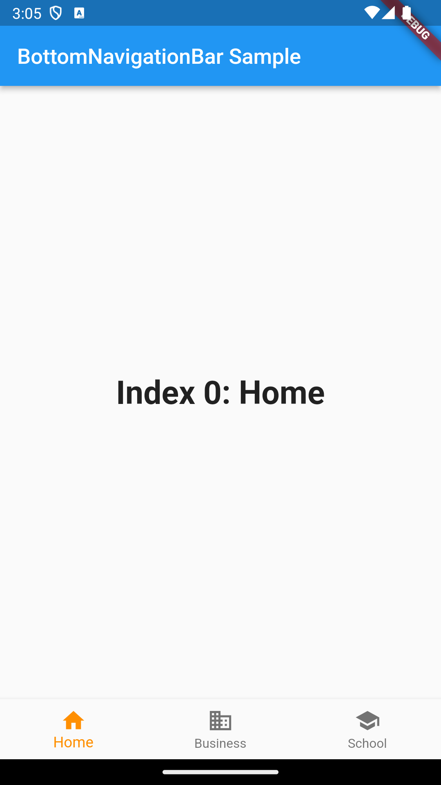

### BottomNavigationBar

### Navigator.push / pop / popUntil / pushAndRemoveUntil
    1. Navigator.popUntil(context, (route) => route.isFirst)
        - 처음으로 돌아온다
    2. pushAndRemoveUntil
        - 해당 페이지로 이동하지만, 돌아올 수 없다

### 외부 라이브러리인 go route 를 사용하는 방법
    Named routing 설정하는 방식과 비슷하므로 이점 없으면 Named routing 사용하기
